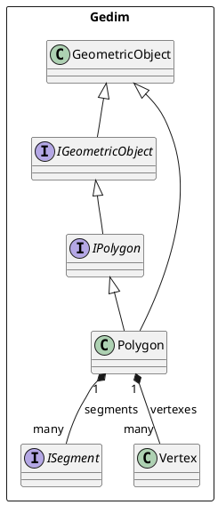

```plantuml
@startuml

package Gedim <<Rectangle>> {
    interface IGeometricObject
    interface ISegment
    interface IPolygon

    class Vertex
    class GeometricObject
    class Polygon
}

GeometricObject <|-- IGeometricObject
IGeometricObject <|-- IPolygon
IPolygon <|-- Polygon
GeometricObject <|-- Polygon

Polygon "1" *-- "many" Vertex : vertexes
Polygon "1" *-- "many" ISegment : segments

@enduml
```