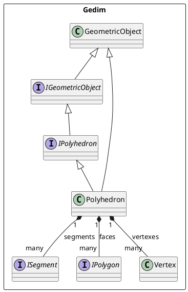

```plantuml
@startuml

package Gedim <<Rectangle>> {
    interface IGeometricObject
    interface ISegment
    interface IPolygon
    interface IPolyhedron

    class Vertex
    class GeometricObject
    class Polyhedron
}

GeometricObject <|-- IGeometricObject
IGeometricObject <|-- IPolyhedron
IPolyhedron <|-- Polyhedron
GeometricObject <|-- Polyhedron

Polyhedron "1" *-- "many" Vertex : vertexes
Polyhedron "1" *-- "many" ISegment : segments
Polyhedron "1" *-- "many" IPolygon : faces

@enduml
```