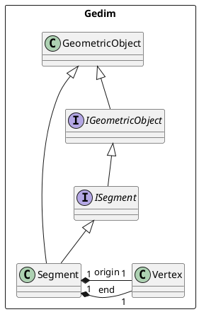

```plantuml
@startuml

package Gedim <<Rectangle>> {
    interface IGeometricObject
    interface ISegment

    class Vertex
    class GeometricObject
    class Segment
}

GeometricObject <|-- IGeometricObject
IGeometricObject <|-- ISegment
ISegment <|-- Segment
GeometricObject <|-- Segment

Segment "1" *- "1" Vertex : origin
Segment "1" *- "1" Vertex : end 

@enduml
```