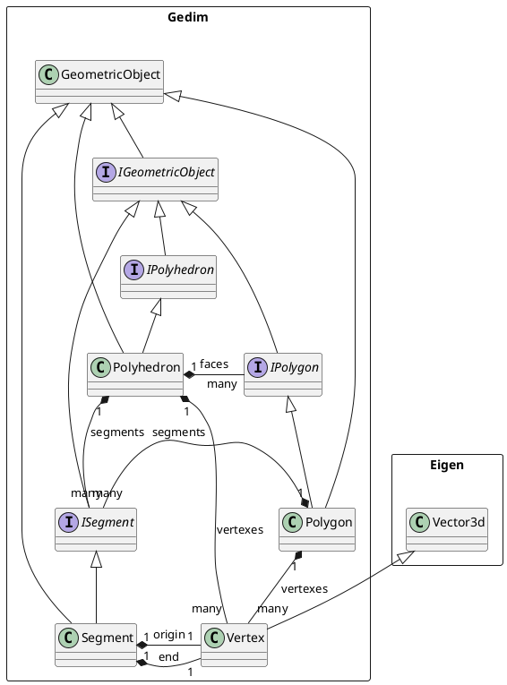

```plantuml
@startuml

package Eigen <<Rectangle>> {
    class Vector3d
}

package Gedim <<Rectangle>> {
    interface IGeometricObject
    interface ISegment
    interface IPolygon
    interface IPolyhedron

    class Vertex
    class GeometricObject
    class Segment
    class Polygon
    class Polyhedron
}

Vector3d <|-- Vertex
GeometricObject <|-- IGeometricObject
IGeometricObject <|-- ISegment
IGeometricObject <|-- IPolygon
IGeometricObject <|-- IPolyhedron
ISegment <|-- Segment
GeometricObject <|-- Segment
IPolygon <|-- Polygon
GeometricObject <|-- Polygon
IPolyhedron <|-- Polyhedron
GeometricObject <|-- Polyhedron

Segment "1" *- "1" Vertex : origin
Segment "1" *- "1" Vertex : end 
Polygon "1" *- "many" Vertex : vertexes
Polygon "1" *- "many" ISegment : segments
Polyhedron "1" *- "many" Vertex : vertexes
Polyhedron "1" *- "many" ISegment : segments
Polyhedron "1" *- "many" IPolygon : faces

@enduml
```