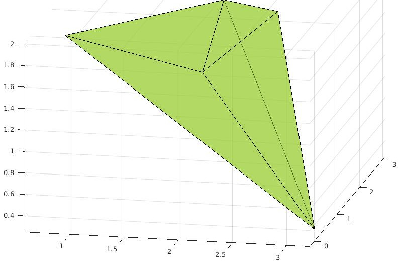

# PPC Project - 3D

## 3D Problem

Create a C++ function which given an input concave polyhedron it returns the list of convex polyhedra.  

The C++ function to be implemented is the following
```c++
/// Function to convert a concave polyhedron to a list of convex polyhedra
/// @param[in] concavePolyhedron - the concave polyhedron
/// @param[out] convexPolyhedra - the list of convex polyhedra
static Output::ExitCodes ConcaveToConvexPolyhedron(const IPolyhedron& concavePolyhedron, list<IPolyhedron*>& convexPolyhedra);
```

## Tests

### Test One

The following image shows the first 3D test:



## Hints

### Generate Other Tests

The following code generates a 3D random polyhedron.

```matlab
npts = 5;
pts = randn(npts, 3);
```

### Show Results

Given a list of points `pts`, it is possible to show them on a plot using the following code:

```matlab
shp = alphaShape(pts);
plot(shp,  'facealpha', 0.5);
```